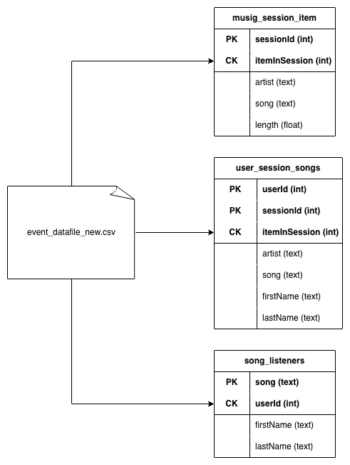

# Data Modeling with Apache Cassandra

ETL pipeline and NoSQL data model built for **Sparkify**, a fictional music streaming startup, to enable fast, query-driven analytics on user listening activity using Apache Cassandra.

This is the first in a series of data engineering portfolio projects, completed as part of the Udacity Data Engineering with AWS Nanodegree.


## Project Overview

Sparkify collects raw event logs from its streaming app, partitioned into daily CSV files, with no easy way to query the data for analysis. This project builds an ETL pipeline that:

1. Reads and consolidates ~30 daily event-log CSV files into a single denormalized dataset
2. Designs a Cassandra data model driven entirely by the target queries (query-first / denormalized modeling)
3. Loads the processed data into Cassandra tables
4. Validates the model by running the analytics team's target queries

The analytics team needed answers to three specific questions about song-play history, and each Cassandra table in this project is purpose-built to answer one of them efficiently — without using `ALLOW FILTERING`.

## Architecture

<div align="center">
  
</div>

---

## Pipeline Stages

### 1. Extract

Walk the `event_data/` directory and collect all daily event CSV files (each containing 17 raw fields: artist, auth, firstName, gender, itemInSession, lastName, length, level, location, method, page, registration, sessionId, song, status, ts, userId).

### 2. Transform

Iterate through every row across all files, drop non-listening events (e.g. logins, page loads with no `artist`), and select/reorder the 11 fields relevant to analysis into a single denormalized file: `event_datafile_new.csv` (~6,820 rows).

### 3. Load

Connect to a local Cassandra cluster via the Python driver, create a `sparkify` keyspace, and load the denormalized data into three purpose-built tables using parameterized `INSERT` statements.

### 4. Validate

Run the three target `SELECT` queries against the loaded tables and inspect results as Pandas DataFrames to confirm the data model returns the expected results.

---

## Tech Stack

- **Apache Cassandra** — NoSQL database, run locally via Docker
- **Docker / Docker Compose** — local Cassandra cluster with persistent storage and health checks
- **Python**
  - `cassandra-driver` — cluster connection and CQL execution
  - `pandas` — data inspection, deduplication checks, result display
  - `csv`, `os`, `glob` — file discovery and CSV processing
- **Jupyter Notebook** — pipeline development and presentation

---

## Data Model & Design Decisions

Cassandra tables are modeled around the queries they need to answer (denormalized, query-first design), rather than normalized relational principles. Each table's primary key is chosen specifically to support its query without `ALLOW FILTERING`.

### 1. `music_session_item`

**Query:** Get the artist, song title, and song length for a given `sessionId` and `itemInSession`.

```sql
PRIMARY KEY (sessionId, itemInSession)
```

- **Partition key (`sessionId`)** groups all events from a session together.
- **Clustering key (`itemInSession`)** orders events within the session and allows direct lookup of a specific item.

### 2. `user_session_songs`

**Query:** Get the artist, song (sorted by `itemInSession`), and user's name for a given `userId` and `sessionId`.

```sql
PRIMARY KEY ((userId, sessionId), itemInSession)
```

- **Composite partition key (`userId`, `sessionId`)** groups all songs played by a user in a specific session.
- **Clustering key (`itemInSession`)** preserves playback order within the session.

### 3. `song_listeners`

**Query:** Get every user (first and last name) who listened to a given song.

```sql
PRIMARY KEY (song, userId)
```

- **Partition key (`song`)** groups all listens of a song together.
- **Clustering key (`userId`)** deduplicates repeat listens, ensuring each user appears once per song.

This deduplication need was confirmed during EDA: checking `(song, userId)` uniqueness in the denormalized dataset showed 357 rows where the same user listened to the same song multiple times, confirming that `userId` as a clustering column was necessary to produce the correct unique-listener results.

---

## Setup & Usage

### Start Cassandra

```bash
docker-compose up -d
```

### Stop Cassandra

```bash
docker-compose down
```

### View logs

```bash
docker-compose logs -f
```

Cassandra takes ~30-60 seconds to fully start. The healthcheck in `docker-compose.yml` confirms the service is ready, and CQL connections are exposed on port `9042`.

### Connect from Python

```python
from cassandra.cluster import Cluster

cluster = Cluster(['127.0.0.1'])
session = cluster.connect()
```

### Run the pipeline

Open `Project_1B_ Project_Template.ipynb` and run all cells. This will:

1. Build `event_datafile_new.csv` from the raw files in `event_data/`
2. Create the `sparkify` keyspace and the three tables described above
3. Load the data and run the validation queries

### Data Persistence

Cassandra data is stored in `./data` and persists between container restarts.

---

## Skills Demonstrated

- NoSQL data modeling: partition keys vs. clustering columns, denormalization for query performance
- ETL development in Python: file discovery, CSV transformation, batch loading
- Parameterized queries with a database driver (no string-concatenated CQL)
- Data validation and exploratory analysis with Pandas to inform schema decisions
- Local infrastructure setup with Docker Compose, including persistent volumes and health checks
